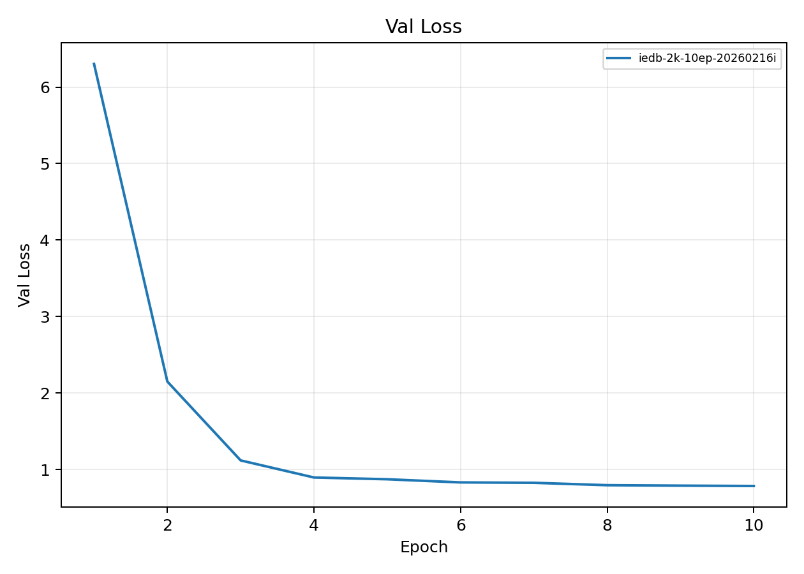

# Earliest IEDB 2K Training Run

**EXP ID**: EXP-31
**Date**: 2026-02-16
**Agent**: Claude Code (claude-opus-4-6)

## Overview

First training run on IEDB data with 2K row cap per assay family. Small model (d_model=64, 1 layer, 2 heads) with 10 epochs.

## Dataset & Training

IEDB data, max 2K rows per assay family. 10 epochs, batch 256, lr=1e-4. d_model=64, n_layers=1, n_heads=2. Earliest successful training run.

## Source Modal Runs

- `modal_runs/iedb-2k-10ep-20260216i/`

## Conditions

| label | final_epoch | best_val_loss |
| --- | --- | --- |
| iedb-2k-10ep-20260216i | 10 | 0.7847 |

## Plots

## Artifacts

- Condition summary: `results/condition_summary.csv`
- Epoch summary: `results/epoch_summary.csv`
- Probe predictions: `results/final_probe_predictions.csv`
- Reproduce: `reproduce/launch.json`
