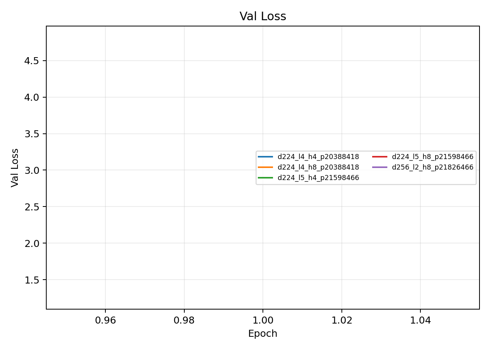
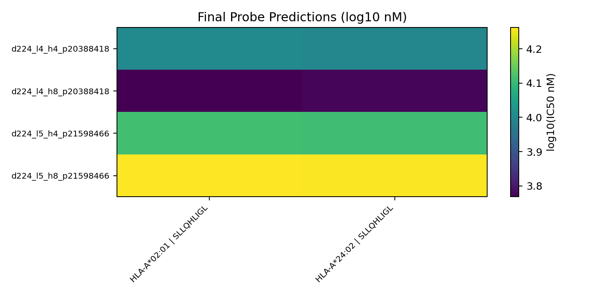

# Architecture Dimension Sweep (d_model x layers x heads)

**EXP ID**: EXP-24
**Date**: 2026-02-26
**Agent**: Claude Code (claude-opus-4-6)

## Overview

Sweep over d_model, n_layers, and n_heads to find optimal model dimensions. Two sweep runs with different batch sizes.

## Dataset & Training

Sweep of d_model={224,...}, n_layers={4,5}, n_heads={4,8}. 20M tokens per candidate, batch 64. Ranking by val_drop_per_epoch.

## Source Modal Runs

- `modal_runs/sweep20m-live-20260226-20260226T171152Z/`
- `modal_runs/sweep20m-snfull-bs64-20260226-20260226T193011Z/`

## Conditions

| label | final_epoch | best_val_loss |
| --- | --- | --- |
| d224_l4_h4_p20388418 | 1 | 1.2942 |
| d224_l4_h8_p20388418 | 1 | 1.2769 |
| d224_l5_h4_p21598466 | 1 | 1.2725 |
| d224_l5_h8_p21598466 | 1 | 1.3498 |
| d256_l2_h8_p21826466 | 1 | 4.7950 |

## Plots

## Artifacts

- Condition summary: `results/condition_summary.csv`
- Epoch summary: `results/epoch_summary.csv`
- Probe predictions: `results/final_probe_predictions.csv`
- Reproduce: `reproduce/launch.json`
