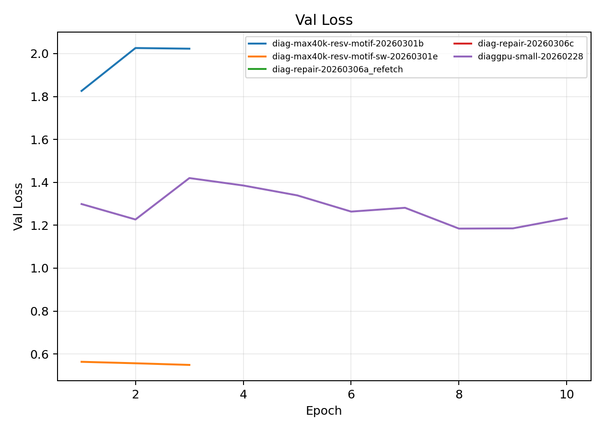
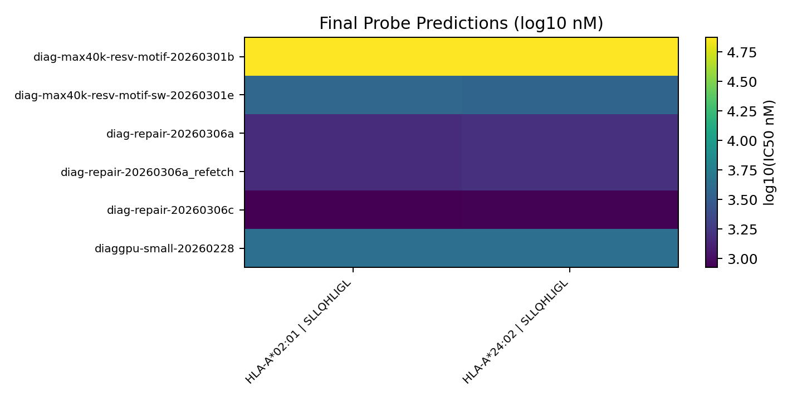

# Diagnostic & Repair Training Runs

**EXP ID**: EXP-26
**Date**: 2026-03-01
**Agent**: Claude Code (claude-opus-4-6)

## Overview

Diagnostic runs for debugging training issues: reservoir sampling, motif scanning, repair iterations, and small-GPU diagnostics.

## Dataset & Training

Diagnostic profile: max_binding=40K, d_model=128, n_layers=2, n_heads=4. 1-3 epochs, batch 256. Various cap_sampling strategies.

## Source Modal Runs

- `modal_runs/diaggpu-small-20260228/`
- `modal_runs/diag-max40k-resv-motif-20260301b/`
- `modal_runs/diag-max40k-resv-motif-sw-20260301e/`
- `modal_runs/diag-repair-20260306a/`
- `modal_runs/diag-repair-20260306a_refetch/`
- `modal_runs/diag-repair-20260306c/`

## Conditions

| label | final_epoch | best_val_loss |
| --- | --- | --- |
| diag-max40k-resv-motif-20260301b | 3.0000 | 1.8261 |
| diag-max40k-resv-motif-sw-20260301e | 3.0000 | 0.5491 |
| diag-repair-20260306a | nan | nan |
| diag-repair-20260306a_refetch | 1.0000 | 0.7220 |
| diag-repair-20260306c | 1.0000 | 0.8165 |
| diaggpu-small-20260228 | 10.0000 | 1.1844 |

## Plots

## Artifacts

- Condition summary: `results/condition_summary.csv`
- Epoch summary: `results/epoch_summary.csv`
- Probe predictions: `results/final_probe_predictions.csv`
- Reproduce: `reproduce/launch.json`
