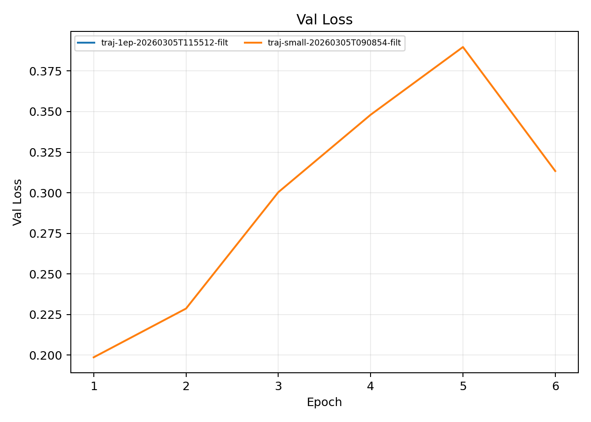
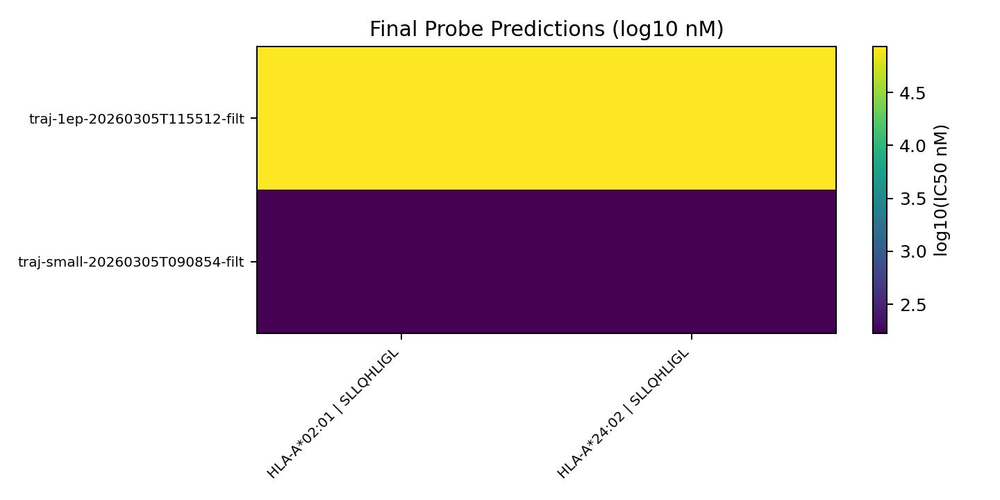

# Training Trajectory Studies

**EXP ID**: EXP-27
**Date**: 2026-03-05
**Agent**: Claude Code (claude-opus-4-6)

## Overview

Training trajectory analysis with small/filtered data subsets to study convergence patterns and loss dynamics.

## Dataset & Training

Canary profile with max_batches=80, max_val_batches=20. 6 epochs (small) or 1 epoch (full filtered). d_model=128, n_layers=2, n_heads=4.

## Source Modal Runs

- `modal_runs/traj-small-20260305T090347/`
- `modal_runs/traj-small-20260305T090854-filt/`
- `modal_runs/traj-1ep-20260305T115512-filt/`

## Conditions

| label | final_epoch | best_val_loss |
| --- | --- | --- |
| traj-1ep-20260305T115512-filt | 1.0000 | 0.3451 |
| traj-small-20260305T090347 | nan | nan |
| traj-small-20260305T090854-filt | 6.0000 | 0.1987 |

## Plots

## Artifacts

- Condition summary: `results/condition_summary.csv`
- Epoch summary: `results/epoch_summary.csv`
- Probe predictions: `results/final_probe_predictions.csv`
- Reproduce: `reproduce/launch.json`
