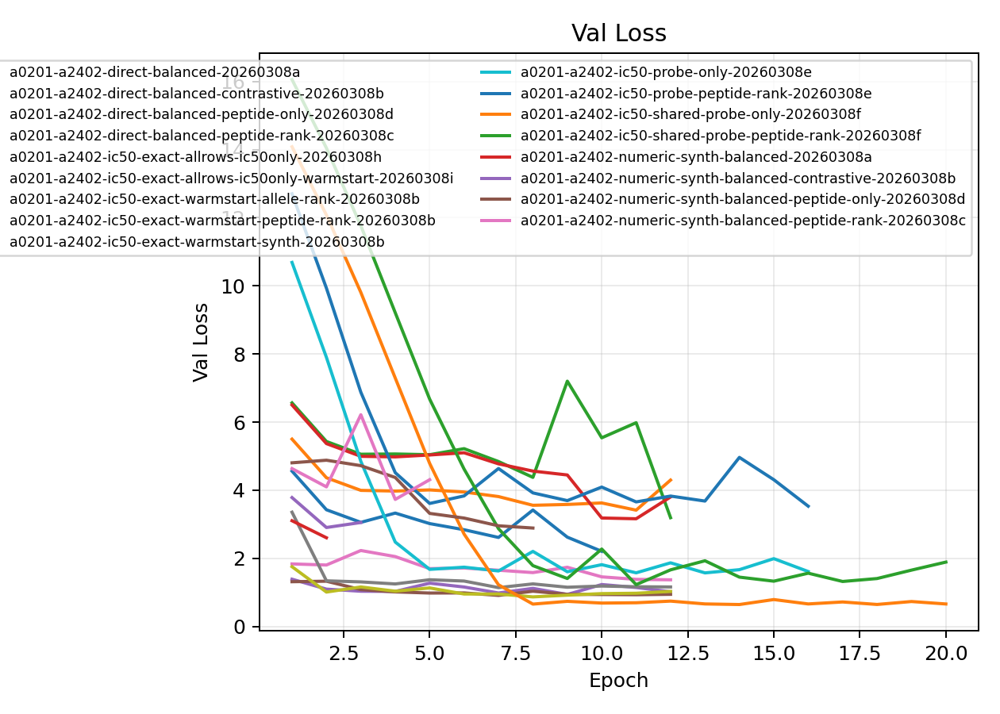
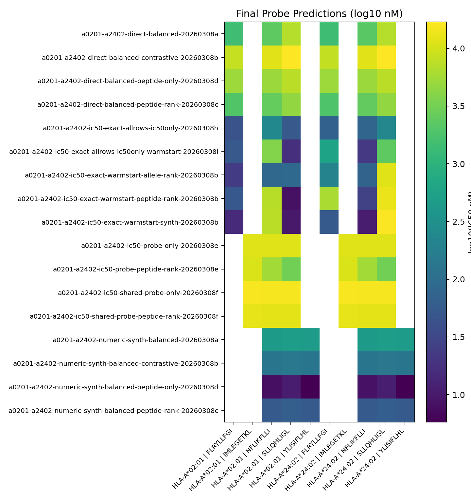

# A*02:01/A*24:02 Target Encoding & Probe Systematic Comparison

**EXP ID**: EXP-21
**Date**: 2026-03-08
**Agent**: Claude Code (claude-opus-4-6)

## Overview

Systematic comparison of target encoding modes (direct, IC50-exact, numeric-synth), probe configurations (probe-only, shared-probe, peptide-rank, allele-rank), and training variants (balanced, contrastive, warmstart, synthetics) on the 2-allele HLA-A*02:01/A*24:02 panel.

## Dataset & Training

2-allele panel (A*02:01, A*24:02). 10 epochs, batch 512 (direct/numeric) or 128 (IC50-exact). GrooveTransformerModel, seed 42. Various measurement profiles and assay modes. Some runs warm-started from mhc-pretrain-20260308b.

## Source Modal Runs

- `modal_runs/a0201-a2402-direct-balanced-20260308a/`
- `modal_runs/a0201-a2402-direct-balanced-contrastive-20260308b/`
- `modal_runs/a0201-a2402-direct-balanced-peptide-only-20260308d/`
- `modal_runs/a0201-a2402-direct-balanced-peptide-rank-20260308c/`
- `modal_runs/a0201-a2402-ic50-exact-allrows-ic50only-20260308h/`
- `modal_runs/a0201-a2402-ic50-exact-allrows-ic50only-warmstart-20260308i/`
- `modal_runs/a0201-a2402-ic50-exact-warmstart-allele-rank-20260308b/`
- `modal_runs/a0201-a2402-ic50-exact-warmstart-peptide-rank-20260308b/`
- `modal_runs/a0201-a2402-ic50-exact-warmstart-synth-20260308b/`
- `modal_runs/a0201-a2402-ic50-probe-only-20260308e/`
- `modal_runs/a0201-a2402-ic50-probe-peptide-rank-20260308e/`
- `modal_runs/a0201-a2402-ic50-shared-probe-only-20260308f/`
- `modal_runs/a0201-a2402-ic50-shared-probe-peptide-rank-20260308f/`
- `modal_runs/a0201-a2402-numeric-synth-balanced-20260308a/`
- `modal_runs/a0201-a2402-numeric-synth-balanced-contrastive-20260308b/`
- `modal_runs/a0201-a2402-numeric-synth-balanced-peptide-only-20260308d/`
- `modal_runs/a0201-a2402-numeric-synth-balanced-peptide-rank-20260308c/`

## Conditions

| label | final_epoch | best_val_loss |
| --- | --- | --- |
| a0201-a2402-direct-balanced-20260308a | 10 | 2.2050 |
| a0201-a2402-direct-balanced-contrastive-20260308b | 12 | 3.4138 |
| a0201-a2402-direct-balanced-peptide-only-20260308d | 12 | 3.1923 |
| a0201-a2402-direct-balanced-peptide-rank-20260308c | 12 | 3.1609 |
| a0201-a2402-ic50-exact-allrows-ic50only-20260308h | 12 | 0.9378 |
| a0201-a2402-ic50-exact-allrows-ic50only-warmstart-20260308i | 12 | 0.9097 |
| a0201-a2402-ic50-exact-warmstart-allele-rank-20260308b | 12 | 1.3685 |
| a0201-a2402-ic50-exact-warmstart-peptide-rank-20260308b | 12 | 1.1392 |
| a0201-a2402-ic50-exact-warmstart-synth-20260308b | 12 | 0.8666 |
| a0201-a2402-ic50-probe-only-20260308e | 16 | 1.5716 |
| a0201-a2402-ic50-probe-peptide-rank-20260308e | 16 | 3.5298 |
| a0201-a2402-ic50-shared-probe-only-20260308f | 20 | 0.6422 |
| a0201-a2402-ic50-shared-probe-peptide-rank-20260308f | 20 | 1.2269 |
| a0201-a2402-numeric-synth-balanced-20260308a | 2 | 2.6030 |
| a0201-a2402-numeric-synth-balanced-contrastive-20260308b | 3 | 2.9042 |
| a0201-a2402-numeric-synth-balanced-peptide-only-20260308d | 8 | 2.8885 |
| a0201-a2402-numeric-synth-balanced-peptide-rank-20260308c | 5 | 3.7291 |

## Plots

## Artifacts

- Condition summary: `results/condition_summary.csv`
- Epoch summary: `results/epoch_summary.csv`
- Probe predictions: `results/final_probe_predictions.csv`
- Reproduce: `reproduce/launch.json`
