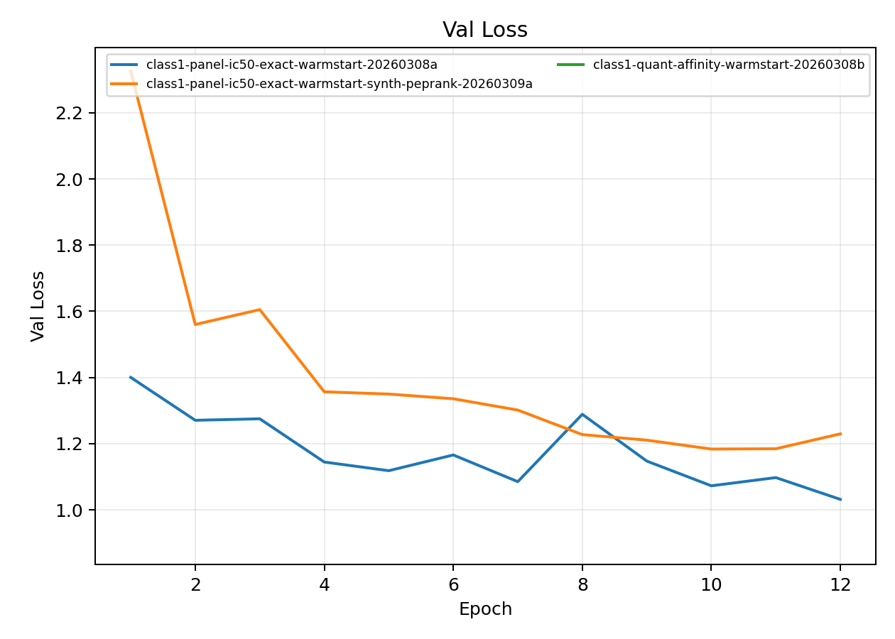
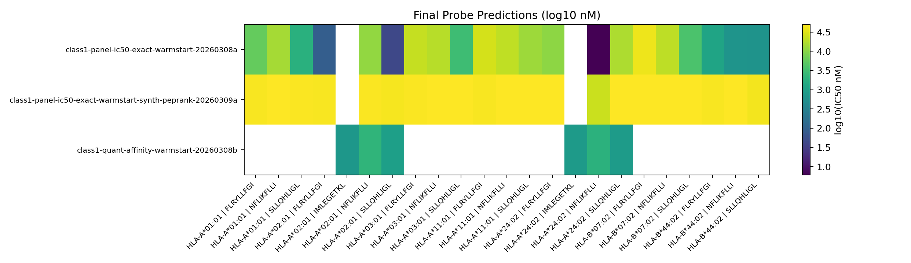

# 7-Allele Class-I Panel Warmstart Variants

**EXP ID**: EXP-22
**Date**: 2026-03-08
**Agent**: Claude Code (claude-opus-4-6)

## Overview

Three 7-allele panel training variants: IC50-exact warmstart, IC50-exact warmstart with synthetics + peptide ranking, and quantitative affinity warmstart.

## Dataset & Training

7-allele class-I panel (A*02:01, A*03:01, A*11:01, A*01:01, A*24:02, B*07:02, B*44:02). 12 epochs, batch 140, GrooveTransformerModel, warm-start from mhc-pretrain-20260308b. IC50-exact or quantitative affinity measurement profiles.

## Source Modal Runs

- `modal_runs/class1-panel-ic50-exact-warmstart-20260308a/`
- `modal_runs/class1-panel-ic50-exact-warmstart-synth-peprank-20260309a/`
- `modal_runs/class1-quant-affinity-warmstart-20260308b/`

## Conditions

| label | final_epoch | best_val_loss |
| --- | --- | --- |
| class1-panel-ic50-exact-warmstart-20260308a | 12 | 1.0316 |
| class1-panel-ic50-exact-warmstart-synth-peprank-20260309a | 12 | 1.1837 |
| class1-quant-affinity-warmstart-20260308b | 1 | 0.9056 |

## Plots

## Artifacts

- Condition summary: `results/condition_summary.csv`
- Epoch summary: `results/epoch_summary.csv`
- Probe predictions: `results/final_probe_predictions.csv`
- Reproduce: `reproduce/launch.json`
