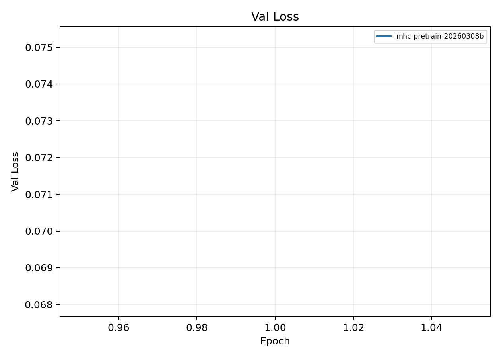

# MHC Sequence Pretraining Baseline

**EXP ID**: EXP-30
**Date**: 2026-03-08
**Agent**: Claude Code (claude-opus-4-6)

## Overview

MHC sequence pretraining on 54K sequences for chain_type, species, and class classification. Used as warm-start checkpoint for downstream runs.

## Dataset & Training

54,419 MHC sequences, 48,977 train / 5,442 val. 1 epoch, batch 192. d_model=128, n_layers=2, n_heads=4. Classification targets: chain_type, species, class.

## Source Modal Runs

- `modal_runs/mhc-pretrain-20260308b/`

## Conditions

| label | final_epoch | best_val_loss |
| --- | --- | --- |
| mhc-pretrain-20260308b | 1 | 0.0716 |

## Plots

## Artifacts

- Condition summary: `results/condition_summary.csv`
- Epoch summary: `results/epoch_summary.csv`
- Probe predictions: `results/final_probe_predictions.csv`
- Reproduce: `reproduce/launch.json`
