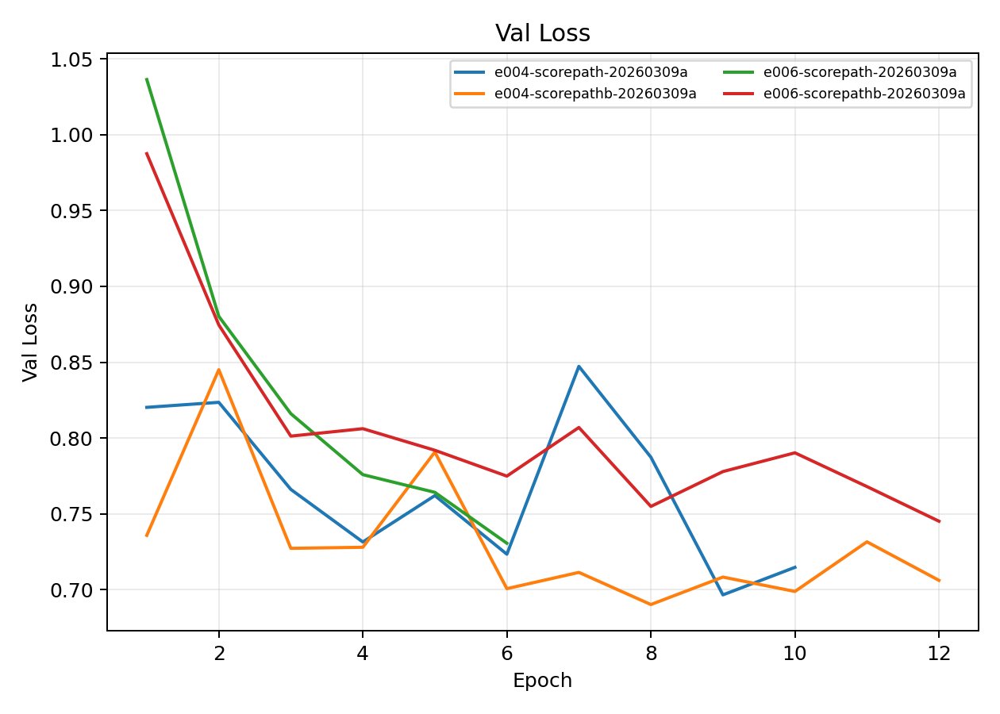
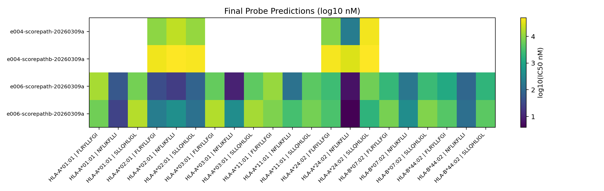

# Score-Path Comparative Benchmark

**EXP ID**: EXP-25
**Date**: 2026-03-09
**Agent**: Claude Code (claude-opus-4-6)

## Overview

Comparative benchmark of different score-path configurations (e004 vs e006) with and without peptide ranking.

## Dataset & Training

Various score-path configurations on 2-allele panel. See individual run summaries for details.

## Source Modal Runs

- `modal_runs/scorepath_bench/`

## Conditions

| label | final_epoch | best_val_loss |
| --- | --- | --- |
| e004-scorepath-20260309a | 10 | 0.6966 |
| e004-scorepathb-20260309a | 12 | 0.6903 |
| e006-scorepath-20260309a | 6 | 0.7307 |
| e006-scorepathb-20260309a | 12 | 0.7452 |

## Plots

## Artifacts

- Condition summary: `results/condition_summary.csv`
- Epoch summary: `results/epoch_summary.csv`
- Probe predictions: `results/final_probe_predictions.csv`
- Reproduce: `reproduce/launch.json`
