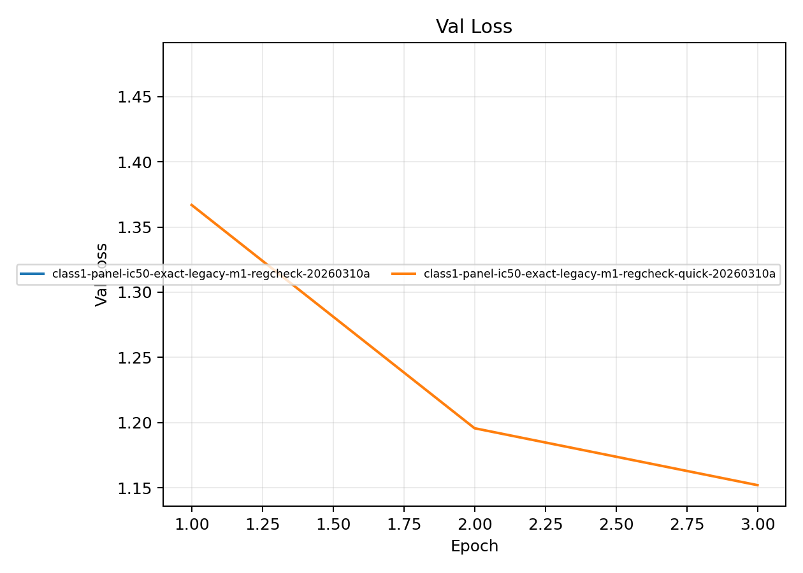
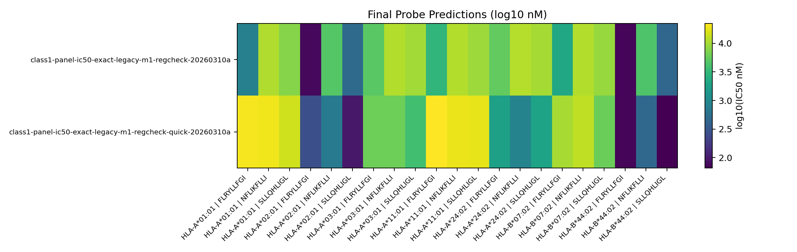

# Legacy M1 Regression Check

**EXP ID**: EXP-29
**Date**: 2026-03-10
**Agent**: Claude Code (claude-opus-4-6)

## Overview

Quick and full regression check of the legacy_m1 baseline to verify probe discrimination was preserved.

## Dataset & Training

7-allele panel, IC50-exact, warmstart. Quick (3 epoch) and full (12 epoch) runs. GrooveTransformerModel.

## Source Modal Runs

- `modal_runs/regcheck/`

## Conditions

| label | final_epoch | best_val_loss |
| --- | --- | --- |
| class1-panel-ic50-exact-legacy-m1-regcheck-20260310a | 1 | 1.4751 |
| class1-panel-ic50-exact-legacy-m1-regcheck-quick-20260310a | 3 | 1.1520 |

## Plots

## Artifacts

- Condition summary: `results/condition_summary.csv`
- Epoch summary: `results/epoch_summary.csv`
- Probe predictions: `results/final_probe_predictions.csv`
- Reproduce: `reproduce/launch.json`
