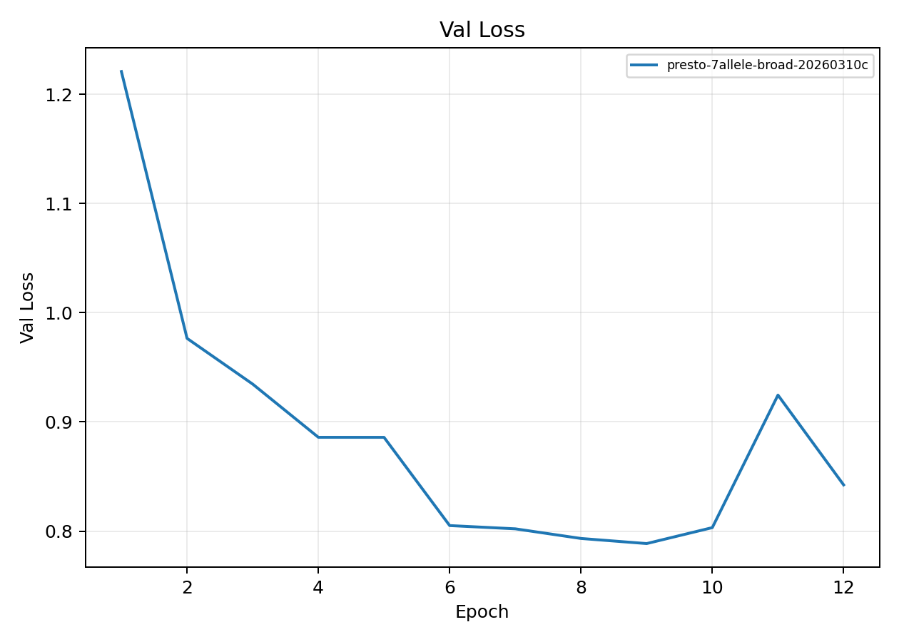
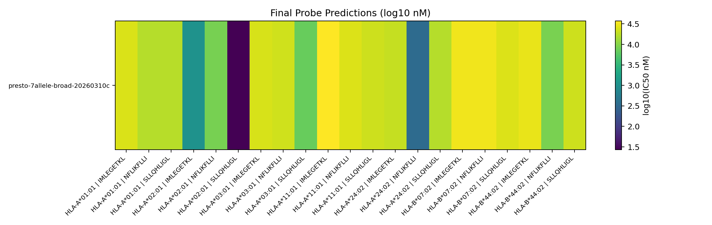

# Broad 7-Allele Presto Baseline

**EXP ID**: EXP-23
**Date**: 2026-03-10
**Agent**: Claude Code (claude-opus-4-6)

## Overview

Broad 7-allele baseline using full Presto model (not groove-only) with numeric_no_qualitative measurement profile.

## Dataset & Training

7-allele class-I panel, numeric_no_qualitative, qualifier_filter=all. Full Presto model with 4.8M params. Warm-start from mhc-pretrain-20260308b.

## Source Modal Runs

- `modal_runs/presto-7allele-broad/`

## Conditions

| label | final_epoch | best_val_loss |
| --- | --- | --- |
| presto-7allele-broad-20260310c | 12 | 0.7886 |

## Plots

## Artifacts

- Condition summary: `results/condition_summary.csv`
- Epoch summary: `results/epoch_summary.csv`
- Probe predictions: `results/final_probe_predictions.csv`
- Reproduce: `reproduce/launch.json`
